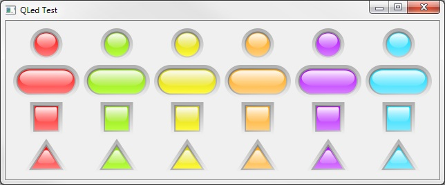
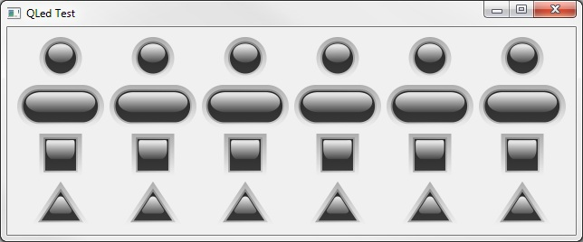

# QLed

[](https://badge.fury.io/py/QLed)

An LED Widget for the PyQt4/5 Framework




## Installation
### pip
`$ pip install QLed`

### setup.py
Download or clone this repository and then run

`$ python setup.py install`

## Usage
```python
from PyQt5.QtWidgets import QApplication, QWidget, QVBoxLayout
from QLed import QLed

class Widget(QWidget):
    def __init__(self ,parent=None, **kwargs):
        super().__init__(parent, **kwargs)
        
        l=QVBoxLayout(self)
        self._led=QLed(self, onColour=QLed.Red, shape=QLed.Circle)
        self._led.value=True
        l.addWidget(self._led)
        
if __name__=="__main__":
    from sys import argv, exit
    
    a=QApplication(argv)
    w=Widget()
    w.show()
    exit(a.exec_())
```

The simple example above creates a single, circular LED that is red in colour when on.

The available shapes are:

* Circle
* Round
* Square
* Triangle

The available colours are:

* Red
* Green
* Yellow
* Grey
* Orange
* Purple
* Blue

The LED is switched on and off by settings the boolean `value` property (either directly or via the setter function `setValue(bool)`).

## Dependencies
* PyQt4/5
* six

## Tested Platforms/Versions
This module has been tested (recently) with the following configurations

* macOS 10.12.6 Sierra, Python 3.6, PyQt5.9, Qt5.9.1, sip 4.19.3
* Ubuntu 16.04LTS, Python 2.7.12, PyQt4.11.4, Qt4.8.7, sip 4.17
